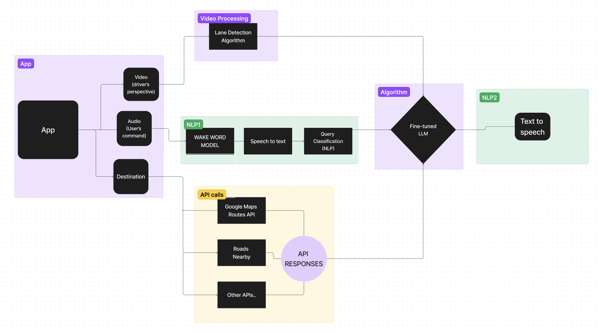
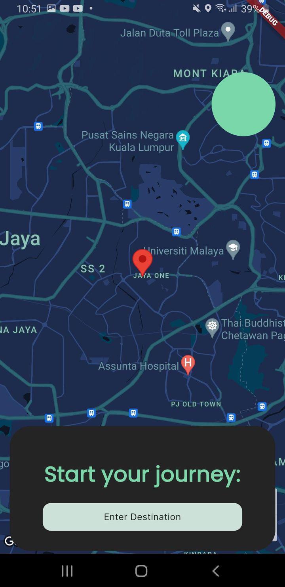
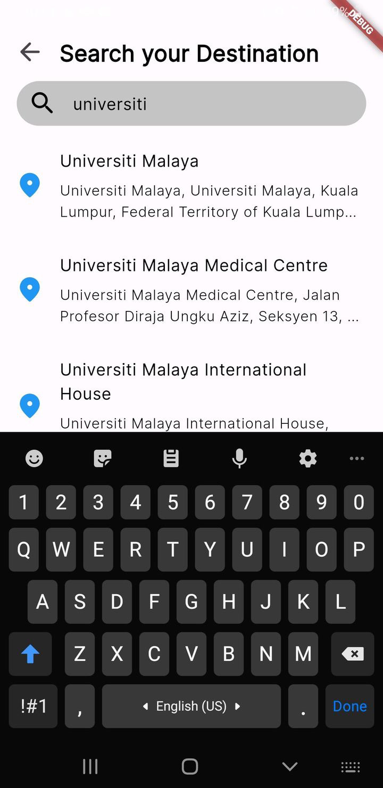

# S.A.R.A. - Smart Automated Routing Assistant

S.A.R.A. is a sophisticated navigation AI assistant whereby users can speak to the app when they face confusions while navigating their route. It's like having a partner riding alongside you, who completely knows your route and who you can speak to and ask for their guidance at any point of confusion on your route.
This project leverages various technologies to enhance the navigation experience, including Flutter, OpenCV, Python, Google Cloud services, and OpenAI APIs.

Built using Flutter!


## Features

- **Lane Guidance**: Onw of the major problems users reported in our survey was that not sufficient information was given when approaching an exit/turn/diversion. For this reason, a comprehensive lane guidance system was developed whereby users would receive verbal instructions that contained contextual information (for eg. Do you see the bridge ahead? take the right just after) and by indicating the lanes (for eg. Stay on the second most right lane for the upcoming diversion).
- **Contextual Data**: Users could ask for any nearby petrol stations or shopping malls, and the app would direct you there. And yes, you just have to speak to it and she will respond and guide you!
- **Traffic Information**: The app also updates users with the latest traffic information, such as road closures, accidents, etc, on the route.


## Overview os the System Architecture

<p align="center" style="margin-top:40px; margin-bottom:40px;"></p>

### 1. App (Main Interface)
Flutter was used as the frontend framework for the app development. The app provides an interface to basically get 3 main inputs:
- **Video (Driver’s Perspective)**: The video of the road ahead of the driver. Needed for processing it using the lane detection algorithm (explained why later on).
- **Audio (User’s Command)**
- **Destination**

### 2. Video Processing
The app transfers the captured video via websockkets (i.e. the video is live streamed) to the backend where the **lane detection algorithm** processes the video. The algorithm outputs the number of lanes on the road and the lane on which the driver is on. This is done to provide detailed lane guidance along the route to the user. You can find the github of its code <a href="https://github.com/cfzd/Ultra-Fast-Lane-Detection-v2">here</a>. This algorithm was made into an API using **flask** that would emit a JSON response containing the number of lanes on the road and the the lane on which the user is currently on.


### 3. NLP1 (Natural Language Processing 1)
Here it would be appropriate to differentiate between 2 terminologies in our context. When we refer to system, it means the AI-speaking assistant and when we refer to the app, we either mean the interface that the user sees or the entire app as a whole, dpending on the context.
- **Wake Word Model**: The app shouldn't be listening to the user all the time. This would be otherwise inefficient and would lead to resource wastage. The system should only listen when the user is calling it. So to schieve this, the user must "wake" the app so that it can start listening. This is done by calling her name 'Sara'. Once the app is "awake", it starts the listening and transcribing process. The model used was an open source implementation of <a href="https://github.com/dscripka/openWakeWord">this</a>.
- **Speech to Text**: The system is now "awake" and is ready to transcribe the user's queries. This app used the native transcription implementation built in iOS and android applications. The native models were failry accurate to say. However, future implementations would include integrating it with whisper from OpenAI.
- **Query Classification (NLP)**: This was a custom model trained on a 1250 user query sample. The queries were inspired from a research conducted by the team and were then augmented to increase sample size. The queries were divided int 4 categories: (a) Lane guidance queries (b) Contextual-Information (c) Traffic- based query and (d) Hands free functionality request. The last category included a sub category of contextual based hands free functionality making the totla number of categories to 5. The model's accuracy was quite high mostly because of the low sample size of the training data. The model determines the intent of the user's query and then asks the app to make the necessary API calls needed to get the data the user is looking for.

### 4. Algorithm
- **Fine-tuned LLM (Language Model)**:  The novelty of the app lies in the fine-tuned gpt 3.5 turbo model trained on around 150 sample conversations. A fine-tuned model is used os that it can generate responses in the most convenietn way possible for the user to understand whilst also containing as much info as possible. 150 may sound less but it was ideal for the model to generate responses with nuances but also stick to the pattern it was trained on. Other services of OpenAI implemented was their text-to-speech model. This fine-tuned model receives data from the different navigation apis and from the lane detection algorithm to generate the most apt response. A sample conversation would look like the follwoing:

  

**User:** "S.A.R.A., I'm approaching a complex junction with multiple exits. Can you guide me on which exit to take?"

**S.A.R.A.:** "Sure! You will see three exits ahead. Please take the second exit. Right before this exit, you will pass by a large billboard for 'Smith's Cafe' on your right, and just after the exit, there is a landmark, Jaya One shopping mall, which should be visible on your left."

**User:** "Got it. What should I look out for after taking the exit?"

**S.A.R.A.:** "After you take the exit, continue straight for about 1.3 kilometers. You will need to turn left onto Jalan 17/1."

after a while

**S.A.R.A:** "Keep an eye out for the Unique Seafood PJ23 restaurant, which will be on your right just before you need to make your turn." 

**User:** "Thanks, S.A.R.A. How's the traffic ahead?"

**S.A.R.A.:** "The traffic is currently flowing smoothly with no significant delays on your route. You should reach your destination without any issues."

**User:** "Perfect. How far is the destination from here?"

**S.A.R.A.:** "You are approximately 3 kilometers away from your destination, Pacific Towers (Capella Residenz). It should take about 10 minutes considering the current traffic conditions."

**User:** "Thank you for the help, S.A.R.A."

**S.A.R.A.:** "You're welcome! Drive safely and let me know if you need more assistance."


### 5. API Calls
- **Google Maps Routes API**: Fetches route information based on the user’s destination and current location.
- **Roads Nearby**: Provides information about nearby roads, which can be useful for rerouting or providing additional context to the user.
- **Other APIs**: These could include APIs for traffic information, weather updates, points of interest, etc.
- **API Responses**: The responses from these API calls are used to provide real-time information and updates to the user.


### 6. NLP2 (Natural Language Processing 2)
- **Text to Speech**: Converts the generated responses from the Fine-tuned LLM into speech, allowing the app to communicate with the user audibly. Uses the OpenAI's tts endpoint


  
## User-flow

The app beigns with the homepage showing the users current location and a search button to look up for their destination.

<p align="center" style="margin-top:40px; margin-bottom:40px;"></p>


On clicking the search button, the user is directed to the search page, where the user can look up for the destination of their choice. On selecting their destination, they are rfedirected to the home page where the whole route is showd on the map along with its synopsis.

<p align="center" style="margin-top:40px; margin-bottom:40px;"></p>

On clicking 'Go', the user is directed to the navigation UI, where turn by turn virsual and auditory instrcutuins are provided. Until here, the UI is pretty much the same as other popular navigation apps. The reason for such a UI was opted because users are now comfortable with such an interface, so deviating from it wouldn't make sense.


  

## Installation

1. **Clone the Repository**:
   ```bash
   git clone https://github.com/your-username/sara-navigation-assistant.git
